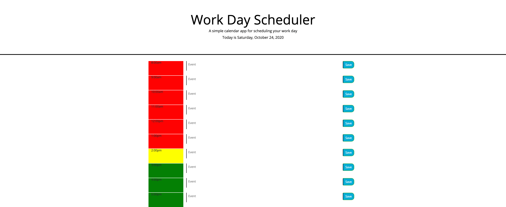
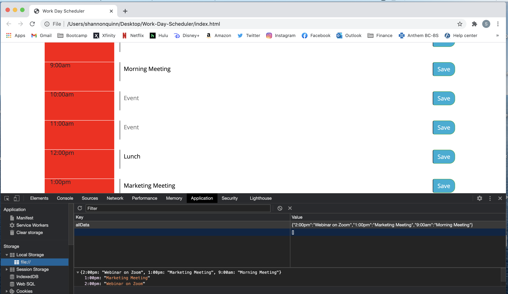

# Work-Day-Scheduler
This project was to create a scheduling tool for a workday. A user will be able to add an event for each hour of the workday and update their schedule as needed. 

Github url: https://github.com/shannonquinn91/Work-Day-Scheduler
Page url: https://shannonquinn91.github.io/Work-Day-Scheduler/

I started by creating an array of hours of the work day and used that array to create a table of elements (in Bootstrap grid). I used to loop to create HTML elements using jQuery. It's a very large for loop, but I like the way it consistently created the rows. 

I got familiar with how to use moment.js to display the date at the top of the page. It took a few tries to get the correct date, but once I figured out what I was looking for in the documentation, I was all set. 

Next, I created a function containing if/else statments to change the background color of the hour column based on the current hour of the day. I used the moment.js format to determine the current hour of the day and used a values array to compare the two integers. That's how I was able to assign a color to the hour column. 

The last part was assigning things to local storage and pulling it in to the text area. I worked with our TA Paul for this part, as local storage was not making a ton of sense to me. We had to create a conditional statement so that in the for loop, we put the users input into a key of an object, but the key had to match the hour. In other words, we had to link the text area and the save button by the hour of the day. 

Once we did that, we started writing the user input to local storage using variables and JSON.stringify. 

Overall, I felt pretty successful with this project and being able to dynamically create almost everything! Local storage is definitely a difficult concept for me, but I'll continue to work on it!

